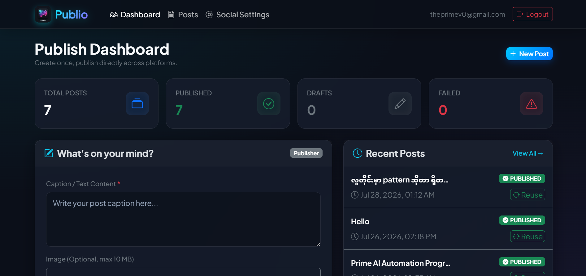
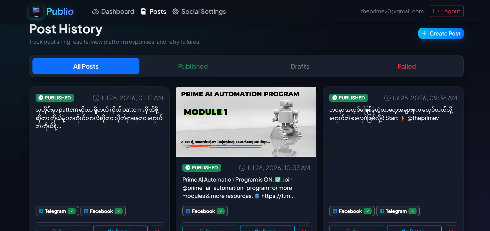
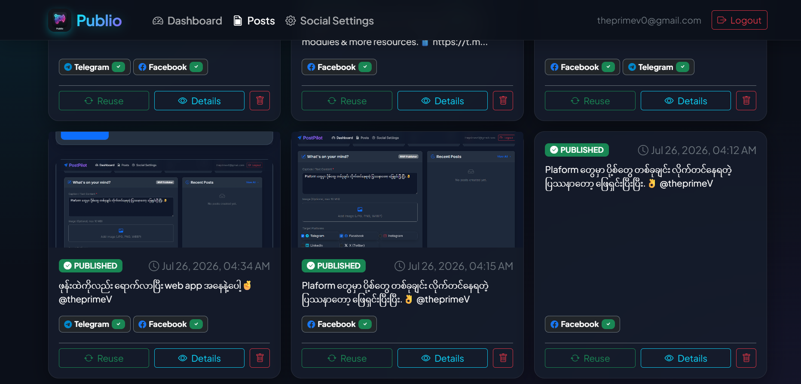
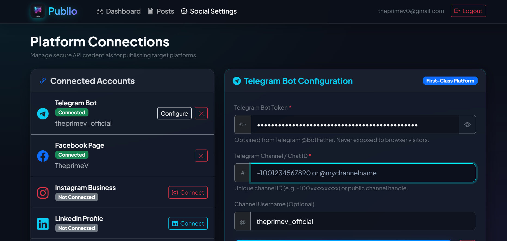

# Publio

> **One post. Multiple platforms.**

Publio is a lightweight, self-hosted social media publishing platform that lets you create content once and publish it directly to **Telegram, Facebook, Instagram, LinkedIn, and X** using official platform APIs.



---

## Overview

Publio is designed for creators, freelancers, agencies, and businesses who want complete control over their social media publishing workflow.

Unlike traditional automation platforms, Publio communicates directly with official platform APIs through secure server-side Edge Functions, giving you better performance, security, and ownership of your data.

---

## Features

### Multi-Platform Publishing

Publish a single post across multiple platforms from one dashboard.

- Telegram
- Facebook
- Instagram
- LinkedIn
- X (Twitter)

### Secure Authentication

- Supabase Authentication
- User profile management
- Session persistence

### Media Management

- Upload images to Supabase Storage
- User-scoped storage
- Caption support
- Optimized media handling

### Platform Connections

Manage all connected social accounts from one place.

- Telegram Bot
- Facebook Page
- Instagram Business
- LinkedIn
- X

### Publishing History

Track every publishing attempt.

- Published
- Pending
- Publishing
- Failed

Retry only failed platforms without publishing everything again.

---

## Tech Stack

### Frontend

- HTML5
- Bootstrap 5
- Vanilla JavaScript

### Backend

- Supabase
- PostgreSQL
- Edge Functions
- Storage
- Authentication

### APIs

- Telegram Bot API
- Facebook Graph API
- Instagram Graph API
- LinkedIn API
- X API v2

---

## Architecture

```text
                Browser
                   │
                   ▼
          Publio Frontend
                   │
                   ▼
              Supabase
     ┌──────────┼──────────┐
     │          │          │
 Authentication Database  Storage
                   │
                   ▼
            Edge Functions
     ┌────────┬────────┬────────┬────────┐
     ▼        ▼        ▼        ▼        ▼
 Telegram  Facebook Instagram LinkedIn    X
```

---

## Project Structure

```text
Publio/
│
├── index.html
├── login.html
├── dashboard.html
├── posts.html
├── settings.html
│
├── css/
│   └── style.css
│
├── js/
│   ├── auth.js
│   ├── config.js
│   ├── platforms.js
│   ├── posts.js
│   ├── storage.js
│   ├── supabase.js
│   ├── ui.js
│   └── utils.js
│
├── supabase/
│   ├── functions/
│   └── sql/
│
├── assets/
├── README.md
└── .env.example
```

---

## Screenshots

### Dashboard


### Post Editor



### Publishing History



### Settings



---

## Getting Started

### 1. Clone Repository

```bash
git clone https://github.com/theprimev/publio.git
cd publio
```

---

### 2. Configure Supabase

Create a new Supabase project and run the SQL files in order.

```text
001_schema.sql
002_rls.sql
003_storage.sql
004_functions.sql
```

---

### 3. Configure Client

Update your project configuration.

```javascript
const SUPABASE_CONFIG = {
    url: "https://your-project.supabase.co",
    anonKey: "your-anon-key"
};
```

---

### 4. Deploy Edge Functions

```bash
npx supabase login

npx supabase link --project-ref YOUR_PROJECT_REF

npx supabase functions deploy publish-telegram
npx supabase functions deploy publish-facebook
npx supabase functions deploy publish-instagram
npx supabase functions deploy publish-linkedin
npx supabase functions deploy publish-x
```

---

## Telegram Setup

1. Create a bot using **@BotFather**
2. Copy your Bot Token
3. Create a Telegram Channel
4. Add the bot as an administrator
5. Enable **Post Messages**
6. Save the Bot Token and Channel ID in Publio Settings

---

## Roadmap

- [x] Authentication
- [x] Multi-platform publishing
- [x] Telegram integration
- [x] Facebook integration
- [x] Instagram integration
- [x] LinkedIn integration
- [x] X integration  
- [x] Publishing history
- [ ] Tittok integration
- [ ] Youtube integration
- [ ] Scheduled publishing
- [ ] Draft management
- [ ] Analytics dashboard
- [ ] Team workspace
- [ ] AI caption generation
- [ ] Content calendar

---

## Contributing

Contributions, feature requests, and bug reports are welcome.

If you have ideas to improve Publio, feel free to open an issue or submit a pull request.

---

## Author

**Pyae Sone Phyo (TheprimeV)**

- GitHub: https://github.com/theprimev
- Telegram: https://t.me/theprimev
- Email: theprimev0@gmail.com

---

## License

This project is licensed under the **MIT License**.
